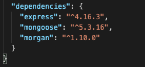
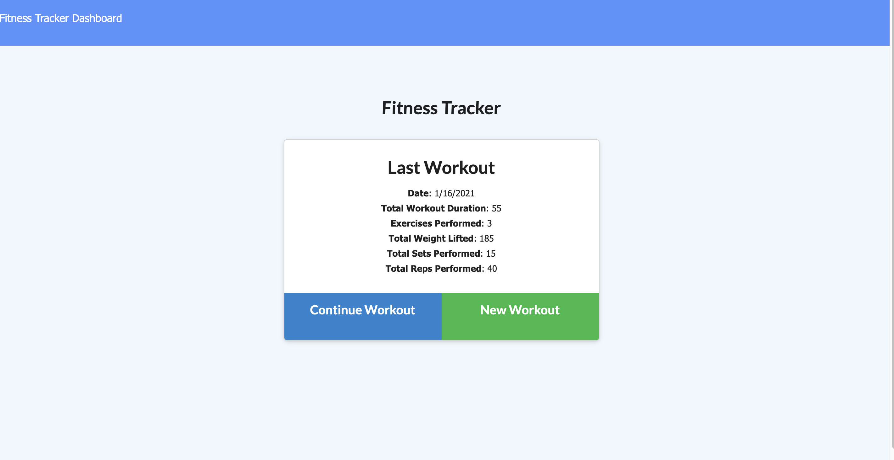
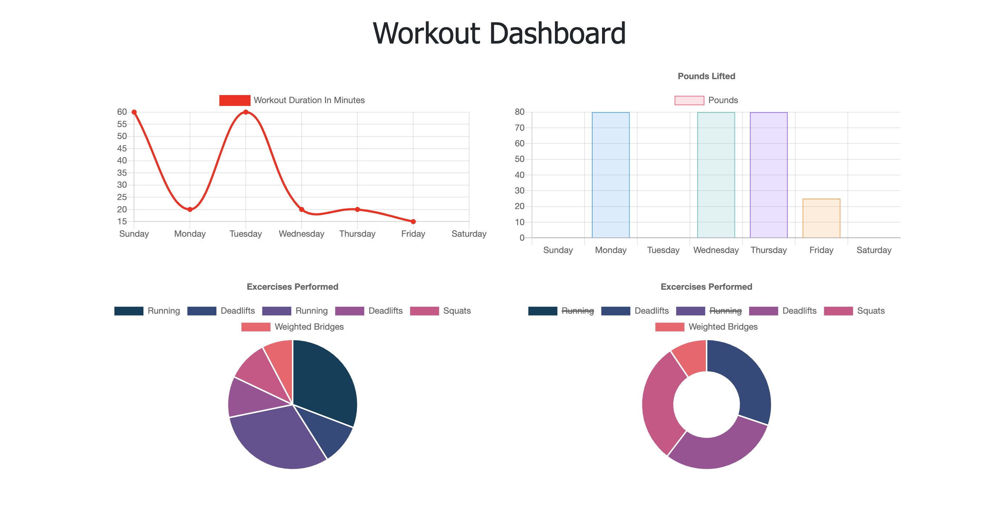
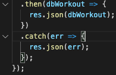

# fitnessTracker 

## Table of Contents

1. [Description](#description)
1. [Video Demo](#videodemo)
1. [Installation](#installation)
1. [Usage](#usage)
1. [License](#license)
1. [Contributing](#contributing)
1. [Tests](#tests)
1. [Questions](#questions)

## Description

The fitnessTrack application is a great way to view, create and track daily workouts. It allows the user to log multiple exercises to a workout on a given day. It takes in the name, type, weight, sets, reps, duration and distance(if cardio) of a workout and stores the data into a NoSQL database using MongoDB. The results of the last workout is always displayed on the homepage and the statistics of the last 7 workouts will display on the dashboard using charts and graphs.

## VideoDemo

## Installation

To install this application the user must have node.js installed. The node depencies that are required are express, mongoose, and morganto utilze MongoDB. It is deployed on Heroku using Mongo Atlas.

  

## Usage

To get started with the application, run `node server.js` or `npm start` in the terminal. The application homepage with display the last workout if there were any stored. It will give the user an option to either create a new workout or continue adding to the most recent workout. When selecting either option, the user is able to select from a Resistance workout or Cardio workout. When selected, it will display the additional relevant selections for the workout. Then, the user can either add the exercise or complete the workout. Clicking 'Dashboard' in the navigation bar will bring the user to the statistics dashboard of the lasy 7 workouts, and clicking 'Fitness Tracker' will bring the user back to the homepage.

  

  

## License

[The Unlicense](http://unlicense.org/)

This project is licensed under [The Unlicense](http://unlicense.org/). Please visit the link for more details.

## Contributing

There were no contributors on this project, but collaboration is welcome. Please feel free to reach out to me regarding changes to the application by creating an issue in Github or contacting me through email.

## Tests

The workouts are tracked by a unique ID that is auotmatically generated using MongoDB. To add to a workout plan, the unique ID is targets in the API route and a put request is made using findByIdAndUpdate, allowing the exercise to be pushed into the new workout plan. This application has a connection to MongoDB and can utilize RoboT3 to view the database. The GET, POST, and PUT routes are located in the api.js file. The calls use asynchronous JavaScript with .then and .catch to either log the results or the error.

   
  
  ## Questions

**Github:** [dargenioa](http://github.com/dargenioa)

**Email:** [dargenioa14@gmail.com](dargenioa14@gmail.com)

For additional questions please feel free to contact me.
